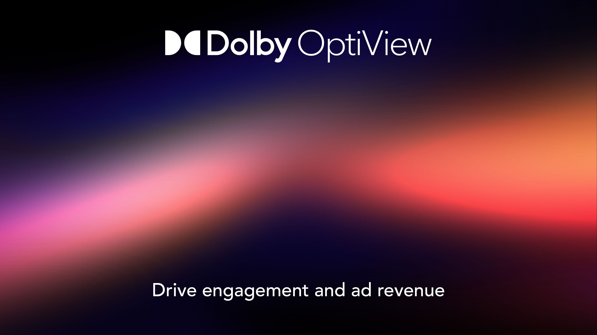

# OptiView Ads HLS Demo

A React demonstration console for OptiView Ads signaling, dynamic ad-break scheduling, and THEOplayer HLS playback. It includes working Unified Streaming and OptiView HLS templates with four THEOplayer instances across two synchronized monetized streams.



## Live demo

[Open the OptiView Ads HLS demo](https://d2aunrdp7zsc16.cloudfront.net/)

The application works from the base URL. Releases set `index.html` to no-cache and invalidate CloudFront, so cache-busting query parameters are not required.

## Features

- OptiView HLS and Unified Streaming source templates
- OptiView Ads signaling-service playback
- THEOplayer with Google IMA DAI integration
- Immediate and scheduled ad breaks
- Single, double, and L-shape layouts
- Per-player countdown indicators
- Clean player recreation when switching templates
- In-browser API request and response log
- Packaged 68-second OptiView sports sizzle HLS ad
- Layout-specific Double Box and L-shape backdrop images
- Living-room TV and landscape-phone device previews that mirror the two monetized streams

## Requirements

- Node.js 20 or newer
- A THEOplayer license
- An OptiView Ads API token for stream-management and ad-break actions

## Local setup

```bash
cp .env.example .env.local
npm ci
npm run dev
```

Set these values in `.env.local`:

| Variable | Purpose |
| --- | --- |
| `VITE_THEOPLAYER_LICENSE` | THEOplayer browser license |
| `VITE_THEO_LIVE_API_TOKEN` | OptiView Ads API token used by API actions |
| `VITE_PUBLIC_ASSET_BASE_URL` | Public base URL used by OptiView Ads to fetch the HLS ad and backdrop images |

The THEOplayer runtime files are copied from the pinned npm dependency into `public/theoplayer` before development and production builds. Generated runtime files are not committed.

The demo ad is served from `public/ads/optiview-sports-sizzle/index.m3u8`. Double Box breaks use `public/backdrops/ads-optiview-sgai-double.jpg`; L-shape breaks use `public/backdrops/ads-optiview-sgai-l.jpg`. These URLs must be publicly reachable because OptiView Ads fetches them while creating the break.

## Build

```bash
npm run build
npm run preview
```

The production output is written to `dist`.

## Deployment

Pushes to `main` run the GitHub Actions deployment workflow. It:

1. Installs dependencies with `npm ci`.
2. Builds the Vite application with repository secrets.
3. Assumes a least-privilege AWS role through GitHub OIDC.
4. Synchronizes `dist` to S3.
5. Applies no-cache headers to `index.html`.
6. Invalidates CloudFront and waits for completion.
7. Verifies the base production URL.

Configure these GitHub Actions secrets:

- `VITE_THEOPLAYER_LICENSE`
- `VITE_THEO_LIVE_API_TOKEN`

Configure this GitHub Actions variable:

- `AWS_DEPLOY_ROLE_ARN`

The workflow deploys to `eu-west-2`, bucket `optiview-ads-demo-031949581493-eu-west-2`, and CloudFront distribution `E35S9M2T3Q49L5`.

## Client-side credential notice

Vite variables prefixed with `VITE_` are embedded in the browser bundle. The repository does not commit credentials, but users of the deployed static application can inspect client-side values. Use a scoped, non-production OptiView Ads token for a public deployment. A server-side API proxy is required if the token must remain confidential.
